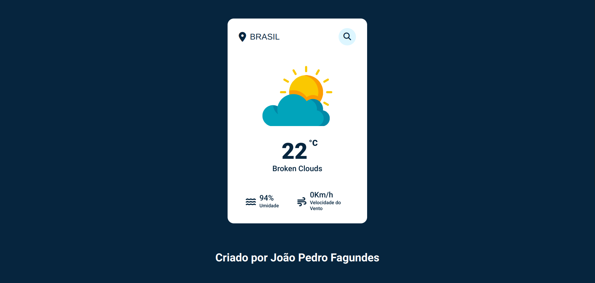

# Weather App

<h1 align="center">
    
</h1>

 

### 💻 Weather App

Foi feita uma aplicação com a finalidade de visualizar o clima de qualquer localidade do planeta.

Acesse a página do projeto: [Clique Aqui](https://weather-app-jpfagundes.netlify.app/)

O que foi feito:

- Lógica e Algoritmos com Javascript;
- Modelo de criação Mobile First;
- Tipos de dados no javascipt;
- Manipular a DOM;
- Consumo de API;
- Estruturando HTML com tags semânticas;
- Responsividade com CSS Flex Box;
- Unidade de medida flexível;
- Posição dos elementos na tela;
- Trabalhando com cores e fontes;
- Aplicando os espaçamentos;
- Bordas e classificações de elementos;
- Animações CSS e transições;

  
 

## 🧪 Tecnologias

Aplicação desenvolvida usando as seguintes tecnologias:

- [HTML5](https://www.w3schools.com/html/default.asp)
- [CSS3](https://www.w3schools.com/css/default.asp)
- [Javascript](https://developer.mozilla.org/pt-BR/docs/Web/JavaScript)

&nbsp;

Criado por João Pedro Fagundes

- ## Meu LinkedIn - 
